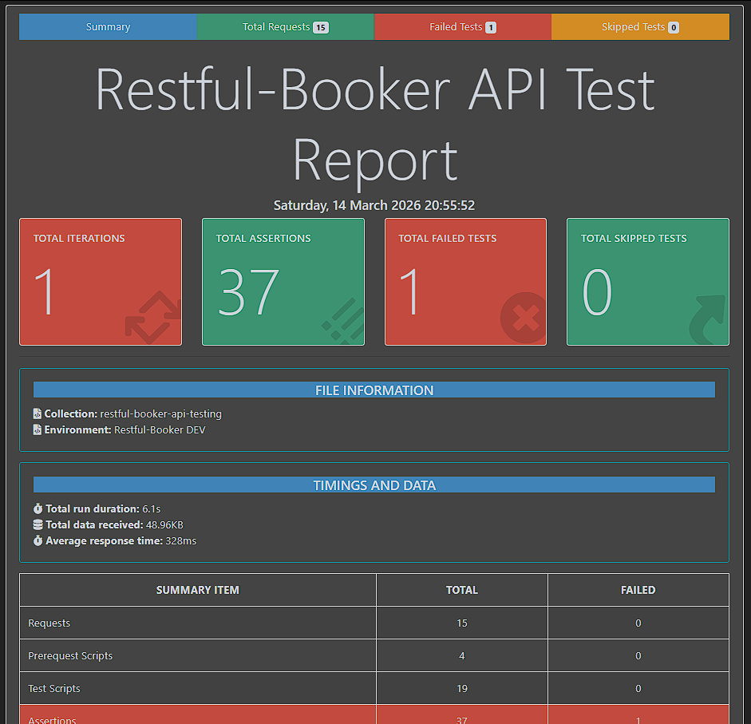

# 🏨 Restful-Booker API Test Suite

Automated API testing project for [Restful-Booker](https://restful-booker.herokuapp.com) — a hotel booking API built specifically for QA practice. This project demonstrates real-world API testing skills including positive, negative, and edge case testing.

---

## 🛠️ Tech Stack

| Tool | Purpose |
|---|---|
| Postman | API test collection & assertions |
| Newman | CLI test runner |
| newman-reporter-htmlextra | HTML test report generation |
| Node.js | Runtime for Newman |

---

## 📁 Project Structure
```
restful-booker-api-testing/
├── restful-booker-collection.json    # Postman collection
├── restful-booker-environment.json   # Environment variables
├── reports/
│   └── test-report.html             # Newman HTML report
└── README.md
```

---

## 🗂️ Test Cases Overview

| TC | Module | Method | Scenario | Type | Expected |
|---|---|---|---|---|---|
| TC-001 | Auth | POST | Generate Token - Valid | Positive | 200 |
| TC-002 | Auth | POST | Generate Token - Invalid | Negative | 200 * |
| TC-003 | GET | GET | Get All Booking IDs | Positive | 200 |
| TC-004 | GET | GET | Get Booking by Valid ID | Positive | 200 |
| TC-005 | GET | GET | Get Booking by Invalid ID | Negative | 404 |
| TC-006 | GET | GET | Filter Bookings by Name | Edge | 200 |
| TC-007 | CREATE | POST | Create Booking - Valid | Positive | 200 * |
| TC-008 | CREATE | POST | Create Booking - Missing Fields | Negative | 400/500 |
| TC-009 | CREATE | POST | Create Booking - Invalid Data Types | Negative | 400 ⚠️ |
| TC-010 | UPDATE | PUT | Full Update - Valid | Positive | 200 |
| TC-011 | UPDATE | PUT | Full Update - No Auth | Negative | 403 |
| TC-012 | UPDATE | PATCH | Partial Update - Valid | Positive | 200 |
| TC-013 | DELETE | DELETE | Delete Booking - Valid | Positive | 201 * |
| TC-014 | DELETE | DELETE | Delete Booking - No Auth | Negative | 403 |

> `*` = API behavior deviates from REST standard — documented in findings below
> `⚠️` = Intentional failing test to document missing input validation defect

---

## ▶️ How To Run

### Prerequisites
- [Node.js](https://nodejs.org) v18+
- Postman (for manual run)

### Install Newman
```bash
npm install -g newman
npm install -g newman-reporter-htmlextra
```

### Run via Newman
```bash
newman run restful-booker-collection.json \
  -e restful-booker-environment.json \
  -r htmlextra \
  --reporter-htmlextra-export reports/test-report.html \
  --reporter-htmlextra-title "Restful-Booker API Test Report" \
  --reporter-htmlextra-browserTitle "Restful-Booker Testing"
```

### Run via Postman
1. Import `restful-booker-collection.json`
2. Import `restful-booker-environment.json`
3. Select `Restful-Booker DEV` environment
4. Run collection via Collection Runner

---

## 📊 Test Results



| Metric | Result |
|---|---|
| Total Requests | 15 |
| Passed Assertions | 36/37 |
| Failed Assertions | 1 (intentional — TC-009) |
| Average Response Time | ~311ms |
| Total Run Duration | ~5.9s |

---

## 🐛 Findings & Known API Limitations

### API Deviations from REST Standards

| ID | Endpoint | Expected | Actual | Note |
|---|---|---|---|---|
| QUIRK-001 | POST /booking | 201 Created | 200 OK | Non-standard create response |
| QUIRK-002 | DELETE /booking/{id} | 204 No Content | 201 Created | Non-standard delete response |
| QUIRK-003 | POST /auth (invalid) | 401 Unauthorized | 200 OK | Error in body, not status code |
| QUIRK-004 | Operations on missing resource | 404 Not Found | 403/405 | Inconsistent error responses |

### Defects Found

**[DEFECT-001] Missing Input Validation — Medium Severity**
- Endpoint: `POST /booking`
- Field: `totalprice` (number), `depositpaid` (boolean)
- Input: `"not-a-number"` (string), `"yes"` (string)
- Expected: `400 Bad Request`
- Actual: `200 OK` — server accepts invalid data types without error
- Impact: Data integrity risk — invalid data can be stored in the system

---

## 💡 Lessons Learned

**1. Test Execution Order Matters**
This suite has dependencies between test cases. Setup requests (Auth + Create Booking) must run first to populate environment variables before other tests execute.

**2. Variable Naming Convention**
Newman is case-sensitive. `{{baseUrl}}` and `{{base_url}}` are treated as different variables. Consistent naming convention across the entire collection is critical.

**3. Environment Stability**
Restful-Booker resets all data every ~10 minutes on Heroku free tier. Auth tokens also expire unpredictably due to server restarts. A dedicated setup request at the beginning of the collection is necessary for reliable automated runs.

**4. Intentional Failing Tests**
A test that intentionally fails to document a defect is more valuable than a passing test that hides a bug. TC-009 is kept as a failing test to highlight the missing input validation issue.

**5. Async Timing in Pre-request Scripts**
`pm.sendRequest()` runs asynchronously — chaining multiple API calls inside a single pre-request script can cause timing issues in Newman. Solution: separate setup logic into individual sequential requests.

---

## 👤 Author

**Dwiputra Juan Ambadatu**
QA Engineer | [LinkedIn](https://www.linkedin.com/in/dwiputra-juan-ambadatu/) | [GitHub](https://github.com/Juanbukanjojo)
